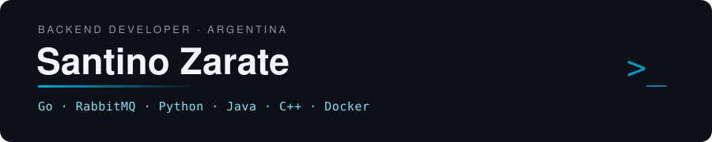

## Hola, soy Santino

### Backend Developer · AR 🇦🇷

Construyo sistemas backend distribuidos — event-driven, escalables, listos para producción.

[LinkedIn](https://www.linkedin.com/in/santino-zarate-ab7938343/) · [Email](zaratesantino4@gmail.com) · [GitHub](https://github.com/santino-zarate)

---

### Stack

También: REST APIs · Arquitectura orientada a eventos

---

### Projects

| Proyecto | Qué es | Stack |
|---|---|---|
| **[ecommerce-distributed-backend](https://github.com/santino-zarate/ecommerce-distributed-backend)** | Backend de e-commerce distribuido con manejo de stock concurrency-safe — cero overselling bajo carga paralela. | Go · RabbitMQ · PostgreSQL · Docker |

---

